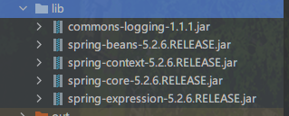
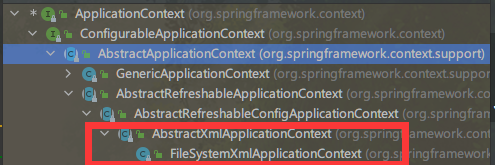
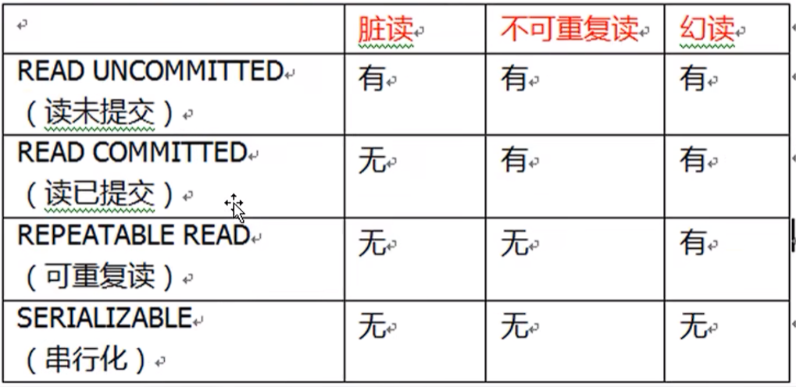
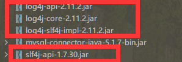

# Spring 实战

## 1 Spring 概念

### 1.1 Spring 介绍

Spring 的核心是一个 *容器*，通常称为 *Spring 应用程序上下文*，用于创建和管理应用程序组件。这些组件（或 bean）在 Spring 应用程序上下文中连接在一起以构成一个完整的应用程序

将 bean 连接在一起的行为是基于一种称为 *依赖注入*（DI）的模式。依赖项注入的应用程序不是由组件自身创建和维护它们依赖的其他 bean 的生命周期，而是依赖于单独的实体（容器）来创建和维护所有组件，并将这些组件注入需要它们的 bean。通常通过构造函数参数或属性访问器方法完成此操作。

除了其核心容器之外，Spring 和完整的相关库产品组合还提供 Web 框架、各种数据持久性选项、安全框架与其他系统的集成、运行时监视、微服务支持、响应式编程模型以及许多其他功能，应用于现代应用程序开发。

### 1.2 Spring 框架概述

1. Spring 是轻量级开源的JavaEE框架
2. Spring 可以解决企业开发的复杂性问题
3. Spring 有两个核心部分：IOC、AOP

#### 1.2.1 IOC 介绍

控制反转，把创建对象的过程交给 Spring 管理，不用 new 的方式

#### 1.2.2 AOP 介绍

面向切面，在不修改源代码的情况下，进行功能增强

### 1.3 Spring 特点

1. 方便解耦，简化开发
2. AOP 编程的支持
3. 方便程序测试
4. 方便和其他框架进行整合
5. 方便进行事务的管理
6. 降低 API 的开发难度

## 2 入门案例

### 2.1 Spring 源码下载地址

Spring源码下载：https://repo.spring.io/ui/native/release/org/springframework/spring/

commons-logging_1.1.1.jar下载：https://nowjava.com/jar/detail/m02262204/commons-logging-1.1.1.jar.html

### 2.2 配置基本功能

1. 导入依赖库

2. 建立一个 User 类，并配置 Spring xml 配置文件

   

   ```xml
   <?xml version="1.0" encoding="UTF-8"?>
   <beans xmlns="http://www.springframework.org/schema/beans"
          xmlns:xsi="http://www.w3.org/2001/XMLSchema-instance"
          xsi:schemaLocation="http://www.springframework.org/schema/beans http://www.springframework.org/schema/beans/spring-beans.xsd">
     <!--配置 User 对象创建-->
     <bean id="user" class="com.ymk.learnSpring.User"></bean>
   </beans>
   ```

3. 新建一个测试类

   ```java
   public class TestSpring5 {
   
       @Test
       public void testAdd() {
           // 1. 加载Spring配置文件
           ApplicationContext context = new ClassPathXmlApplicationContext("bean1.xml");
           // 2. 获取配置创建的变量
           User user = context.getBean("user", User.class);
           // 3. 测试输出
           System.out.println(user);
           user.add();
       }
   }
   ```

## 3 IOC 容器

### 3.1 IOC 概念

- 把对象创建和对象之间调用的过程，交给Spring管理
- 降低代码耦合
- 入门案例就是 IOC 的一种实现

#### 3.2 IOC 底层原理

- **使用技术：**XML解析、工厂模式、反射

- **工厂模式：**解耦

  ```java
  // UserService.java
  class UserService {
      execute() {
          UserAdd add = UserFactory.getAdd();
      }
  }
  ```

  ```java
  // UserAdd.java
  class UserAdd {
      add() {
          // todo
      }
  }
  ```

  ```java
  // UserFactory.java
  class UserFactory {
  	public static UserAdd getAdd() {
          return new UserAdd();
      }
  }
  ```

- **IOC 的过程**

  1. 配置 XML 文件

     ```xml
     <?xml version="1.0" encoding="UTF-8"?>
     <beans xmlns="http://www.springframework.org/schema/beans"
            xmlns:xsi="http://www.w3.org/2001/XMLSchema-instance"
            xsi:schemaLocation="http://www.springframework.org/schema/beans http://www.springframework.org/schema/beans/spring-beans.xsd">
       <!--配置 User 对象创建-->
       <bean id="user" class="com.ymk.learnSpring.User"></bean>
     </beans>
     ```

  2. 创建工厂类

     ```java
     // UserFactory.java
     class UserFactory {
     	public static UserAdd getAdd() {
             String classValue = class属性值; // xml解析得到对象名
             Class clazz = Class.forName(classValue); // 通过反射创建对象
             return (UserAdd)clazz.newInstance();
         }
     }
     ```

- **IOC 思想**

  1. IOC 思想基于 IOC 容器完成，IOC 容器底层就是对象工厂
  
  2. Spring 提供 IOC 容器实现的两种方式
     1. BeanFactory：IOC 容器实现，是 Spring 内部的使用接口，不提供开发人员进行使用（**加载配置文件时不会加载里面的对象，在获取对象时才会创建对象**）
     2. ApplicationContext：BeanFactory 接口的子接口，提供更多更强大的功能，一般由开发人员使用（**加载配置文件时就会把对象创建**）
     
  3. ApplicationContext 接口实现类
  
     

## 4 Bean 管理

### 4.1 什么是 Bean 管理

Bean 管理指用 Spring 创建对象，注入属性

- **基于 XML 方式**

  1. 基于 XML 方式创建对象

     ```xml
     <bean id="user" class="com.ymk.learnSpring.User"></bean>
     ```

     在 Spring 文件中添加 bean 标签，添加对应属性，即可实现对象创建（创建对象时默认使用的**无参构造**）

     bean 属性

     1. id 属性：唯一标识
     2. class 属性：创建对象的类路径
     3. name 属性：与 id 类似，区别是 id 中不能加特殊符号，name 中可以加

  2. 基于 XML 方式注入属性

     (1) DI: 依赖注入，就是注入属性

     第一种注入方式：使用 set 方法注入

     ```xml
       <bean id="book" class="com.ymk.learnSpring.Book">
         <!--注入属性-->
         <property name="name" value="斗罗大陆"></property>
       </bean>
     ```

     ```
     @Test
     public void testBook1() {
         // 1. 加载Spring配置文件
         ApplicationContext context = new ClassPathXmlApplicationContext("bean1.xml");
         // 2. 获取配置创建的变量
         Book book = context.getBean("book", Book.class);
         // 3. 测试输出
         book.printName();
     }
     ```

     第二种注入方式：使用有参构造器注入

     ```xml
       <bean id="book" class="com.ymk.learnSpring.Book">
         <!--注入属性-->
         <constructor-arg name="name" value="天蚕变"></constructor-arg>
     <!--    <constructor-arg index="0" value="天蚕变"></constructor-arg>-->
       </bean>
     ```

     (2) P 名称空间注入

     可以简化基于 XML 配置方式

  3. 基于 XML 注入其他类型属性

     1. 设置属性为空

        ```xml
        <property name="name"><null></null></property>
        ```

     2. 属性值包含特殊符号

        ```xml
        <!--转义特殊字符-->
        <property name="name" value="&lt;斗罗大陆&lt;"></property>
        <property name="name">
              <value><![CDATA[《斗罗大陆》]]></value>
            </property>
        ```

  4. 基于 XML 注入外部 bean

     (1)配置 xml 文件

     ```xml
       <bean id="userService" class="com.ymk.learnSpring.service.UserService">
         <!--注入外部bean userImpl-->
         <property name="userDao" ref="userDaoImpl"></property>
       </bean>
       <bean id="userDaoImpl" class="com.ymk.learnSpring.dao.UserDaoImpl"></bean>
     ```

     (2)实现接口和实现类

     ```java
     // UserService
     public class UserService {
         
         // 创建UserDao属性
         private UserDao userDao;
     
         public void setUserDao(UserDaoImpl userDao) {
             this.userDao = userDao;
         }
     
         public void add() {
             System.out.println("Service Add.............");
             this.userDao.update();
         }
     }
     ```

     ```java
     // UserDao接口
     public interface UserDao {
         public void update();
     }
     ```

     ```java
     // UserDaoImpl实现类
     public class UserDaoImpl implements UserDao{
     
         @Override
         public void update() {
             System.out.println("Update..........");
         }
     }
     ```

  5. 注入属性-内部 bean
  
     (1)一对多关系：部门和员工
  
     ​	一个部门里有多个员工
  
     (2)在实体类之间表示一对多的关系
  
     ```java
     // 部门类
     public class Dept {
         private String name;
     
         public void setName(String name) {
             this.name = name;
         }
     }
     
     // 员工类
     public class Emp {
         private String name;
         private String gender;
     
         // 员工属于某一个部门，使用对象形式表示
         private Dept dept;
     
         public void setDept(Dept dept) {
             this.dept = dept;
         }
     
         public void setName(String name) {
             this.name = name;
         }
     
         public void setGender(String gender) {
             this.gender = gender;
         }
     }
     ```
  
     ```xml
     <!--内部bean-->
     <bean id="emp" class="com.ymk.learnSpring.bean.Emp">
       <!--先设置两个普通属性-->
       <property name="name" value="ymk"></property>
       <property name="gender" value="female"></property>
       <!--设置对象类型属性-->
       <property name="dept">
         <bean id="dept" class="com.ymk.learnSpring.bean.Dept">
           <property name="name" value="开发部"></property>
         </bean>
       </property>
     </bean>
     ```
  
  6. 注入属性-级联赋值
  
     ```xml
     <bean id="emp" class="com.ymk.learnSpring.bean.Emp">
         <!--先设置两个普通属性-->
         <property name="name" value="ymk"></property>
         <property name="gender" value="female"></property>
         <!--设置对象类型属性-->
         <!--级联赋值-->
         <!--第一种写法-->
         <property name="dept" ref="dept"></property>
         <!--第二种写法-->
     	<property name="dept.name" value="技术部"></property>
     </bean>
     <bean id="dept" class="com.ymk.learnSpring.bean.Dept">
         <property name="name" value="营销部"></property>
     </bean>
     ```
  
  7. 注入集合类型属性-数组属性
  
     ```xml
     <?xml version="1.0" encoding="UTF-8"?>
     <beans xmlns="http://www.springframework.org/schema/beans"
            xmlns:xsi="http://www.w3.org/2001/XMLSchema-instance"
            xsi:schemaLocation="http://www.springframework.org/schema/beans http://www.springframework.org/schema/beans/spring-beans.xsd">
     
       <bean id="stu" class="com.ymk.learnSpring.collectiontype.Student">
         <!--数组类型注入-->
         <property name="coursesArray">
           <array>
             <value>Math</value>
             <value>English</value>
             <value>PE</value>
           </array>
         </property>
         <!--list类型注入-->
         <property name="coursesList">
           <list>
             <value>Math</value>
             <value>English</value>
             <value>PE</value>
           </list>
         </property>
         <!--map类型注入-->
         <property name="coursesMap">
           <map>
             <entry key="ymk" value="math"></entry>
             <entry key="ztt" value="english"></entry>
           </map>
         </property>
         <!--set类型注入-->
         <property name="coursesSet">
           <set>
             <value>Math</value>
             <value>English</value>
             <value>PE</value>
           </set>
         </property>
       </bean>
     </beans>
     ```
  
     对象类型数组的注入
  
     ```xml
     <?xml version="1.0" encoding="UTF-8"?>
     <beans xmlns="http://www.springframework.org/schema/beans"
            xmlns:xsi="http://www.w3.org/2001/XMLSchema-instance"
            xsi:schemaLocation="http://www.springframework.org/schema/beans http://www.springframework.org/schema/beans/spring-beans.xsd">
     
       <bean id="stu" class="com.ymk.learnSpring.collectiontype.Student">
         <property name="coursesList">
           <list>
             <ref bean="course1"></ref>
             <ref bean="course2"></ref>
           </list>
         </property>
         <!--注入Course对象-->
         <property name="course">
           <bean id="course" class="com.ymk.learnSpring.collectiontype.Course">
             <property name="courseName" value="面向对象"></property>
           </bean>
         </property>
         <property name="course" ref="course1"></property>
         <property name="course.courseName" value="面向对象2"></property>
       </bean>
       <bean id="course1" class="com.ymk.learnSpring.collectiontype.Course">
         <property name="courseName" value="面向对象1"></property>
       </bean>
       <bean id="course2" class="com.ymk.learnSpring.collectiontype.Course">
         <property name="courseName" value="注入对象"></property>
       </bean>
     </beans>
     ```
  
  8. 使用 util 把集合注入部分提取出来
  
     1. 在 Spring 配置文件中引入名称空间
  
        ```xml
        <?xml version="1.0" encoding="UTF-8"?>
        <beans xmlns="http://www.springframework.org/schema/beans"
               xmlns:xsi="http://www.w3.org/2001/XMLSchema-instance"
               xmlns:util="http://www.springframework.org/schema/util"
               xsi:schemaLocation="http://www.springframework.org/schema/beans http://www.springframework.org/schema/beans/spring-beans.xsd
                                  http://www.springframework.org/schema/util http://www.springframework.org/schema/util/spring-util.xsd">
        
          <!--提取list集合类型-->
          <util:list id="bookList">
            <value>三国</value>
            <value>天龙八部</value>
            <value>水浒</value>
            <value>红楼梦</value>
          </util:list>
        
          <!--list集合属性注入使用-->
          <bean id="book" class="com.ymk.learnSpring.collectiontype.Book">
            <property name="bookList" ref="bookList"></property>
          </bean>
        </beans>
        ```

### 4.2 工厂 Bean (FactoryBean)

1. Spring 有两种类型 bean，一种普通 bean，一种 FactoryBean

2. **普通 bean**

   xml 里定义的 bean 类型就是你的返回类型

3. **FactoryBean**

   xml 里定义的 bean 类型可以和返回的类型不一样

   **使用方法**

   1. 创建类，让这个类作为工厂 bean 实现接口 FactoryBean
   2. 实现接口里方法，在实现的方法中定义返回的 bean 类型

### 4.3 Bean 作用域

1. 在 Spring 里，设置创建 bean 实例是单实例还是多实例

2. 在 Spring 里，默认情况下，bean 是单实例对象

   **试一试默认情况下，是单实例还是多实例**，测试下两个实例是否是同一地址

   ```java
   public class TestSpring5 {
   
       @Test
       public void testBean5() {
           // 1. 加载Spring配置文件
           ApplicationContext context = new ClassPathXmlApplicationContext("bean5.xml");
           // 2. 获取配置创建的变量
           Book book1 = context.getBean("book", Book.class);
           Book book2 = context.getBean("book", Book.class);
           // 3. 测试输出
           System.out.println(book1);
           System.out.println(book2);
       }
   }
   // 结果
   com.ymk.learnSpring.collectiontype.Book@55183b20
   com.ymk.learnSpring.collectiontype.Book@55183b20
   ```

3. **如何设置 bean 多实例对象**

   1. bean 标签里的属性 scope 用于设置单实例还是多实例

   2. scope 属性

      不写属性有个默认值，singleton，表示单实例

      可选 prototype，表示多实例，每次创建变量时会创建不同的变量

      ```java
      // 结果
      com.ymk.learnSpring.collectiontype.Book@55183b20
      com.ymk.learnSpring.collectiontype.Book@4f83df68
      ```

   3. **注意：**设置 scope 的值为 singleton 时，加载 Spring 配置时就会自动创建单实例对象。
      设置 scope 的值为 prototype 时，不是在加载 Spring 配置文件时去创建对象，而是在获取对象时创建，每次都是一个新的对象

### 4.4 Bean 生命周期

- **bean 的生命周期（bean 创建到销毁的过程）**

  1. 通过构造器创建 bean 实例（无参数构造）
  2. 为 bean 的属性设置值和对其他 bean 的引用（调用 set 方法）
  2. （可选）bean 前置处理器
  3. 调用 bean 的初始化方法（需要自己配置初始化方法）
  3. （可选）bean 后置处理器
  4. bean 可以使用了（对象已经获取到了）
  5. 当容器关闭时，调用 bean 销毁的方法（需要自己配置销毁的方法）

- **演示 bean 生命周期**

  ```xml
  <?xml version="1.0" encoding="UTF-8"?>
  <beans xmlns="http://www.springframework.org/schema/beans"
         xmlns:xsi="http://www.w3.org/2001/XMLSchema-instance"
         xmlns:util="http://www.springframework.org/schema/util"
         xsi:schemaLocation="http://www.springframework.org/schema/beans http://www.springframework.org/schema/beans/spring-beans.xsd
                            http://www.springframework.org/schema/util http://www.springframework.org/schema/util/spring-util.xsd">
  
    <bean id="orders" class="com.ymk.learnSpring.bean.Orders" init-method="init" destroy-method="destory">
      <property name="oname" value="phone"></property>
    </bean>
  </beans>
  ```
  
  ```java
  public class Orders {
      private String oname;
  
      public Orders() {
          System.out.println("---------- 1.执行无参构造----------");
      }
  
      public String getOname() {
          return oname;
  
      }
  
      public void setOname(String oname) {
          System.out.println("----------2.执行 set 方法----------");
          this.oname = oname;
      }
  
      // 创建一个 bean 初始化方法
      public void init() {
          System.out.println("----------3.执行 bean 初始化方法----------");
      }
  
      // 创建一个 bean 销毁方法
      public void destory() {
          System.out.println("----------5.执行 bean 销毁方法----------");
      }
      
      @Test
      public void testBean7() {
          // 1. 加载Spring配置文件
          ApplicationContext context = new ClassPathXmlApplicationContext("bean7.xml");
          // 2. 获取配置创建的变量
          Orders orders = context.getBean("orders", Orders.class);
          // 3. 测试输出
          System.out.println(orders.getOname());
          // 4. 销毁 bean
          ((ClassPathXmlApplicationContext) context).close();
      }
  }
  ```
  
- **把 bean 实例传递给 bean 的后置处理器**

  1. 先配置xml中的后置处理器

     ```xml
     <?xml version="1.0" encoding="UTF-8"?>
     <beans xmlns="http://www.springframework.org/schema/beans"
            xmlns:xsi="http://www.w3.org/2001/XMLSchema-instance"
            xmlns:util="http://www.springframework.org/schema/util"
            xsi:schemaLocation="http://www.springframework.org/schema/beans http://www.springframework.org/schema/beans/spring-beans.xsd
                               http://www.springframework.org/schema/util http://www.springframework.org/schema/util/spring-util.xsd">
     
       <bean id="orders"
             class="com.ymk.learnSpring.bean.Orders"
             init-method="init"
             destroy-method="destory">
         <property name="oname" value="phone"></property>
       </bean>
       <!--配置后置处理器-->
       <!--为当前配置文件中的所有 bean 都添加后置处理器-->
       <bean id="myBeanPost" class="com.ymk.learnSpring.bean.MyBeanPost"></bean>
     </beans>
     ```

  2. 初始化之前会执行

     ```java
     @Override
     public Object postProcessBeforeInitialization(Object bean, String beanName) throws BeansException {
         return BeanPostProcessor.super.postProcessBeforeInitialization(bean, beanName);
     }
     ```

  3. 初始化之后会执行

     ```java
     @Override
     public Object postProcessAfterInitialization(Object bean, String beanName) throws BeansException {
         return BeanPostProcessor.super.postProcessAfterInitialization(bean, beanName);
     }
     ```

  4. **运行结果**

     ```
     ---------- 1.执行无参构造----------
     ----------2.执行 set 方法----------
     ----------初始化之前会执行----------
     ----------3.执行 bean 初始化方法----------
     ----------初始化之后会执行----------
     phone
     ----------5.执行 bean 销毁方法----------
     ```

### 4.5 Bean 管理 (xml自动装配)

```xml
<?xml version="1.0" encoding="UTF-8"?>
<beans xmlns="http://www.springframework.org/schema/beans"
       xmlns:xsi="http://www.w3.org/2001/XMLSchema-instance"
       xmlns:util="http://www.springframework.org/schema/util"
       xsi:schemaLocation="http://www.springframework.org/schema/beans http://www.springframework.org/schema/beans/spring-beans.xsd
                          http://www.springframework.org/schema/util http://www.springframework.org/schema/util/spring-util.xsd">

  <!--  实现自动装配
      byName: 根据属性名注入，注入bean的id值和类属性名称一样
      byType: 根据属性类型注入，注入bean的类型与类属性类型相同-->
  <bean id="emp"
        class="com.ymk.learnSpring.autowire.Employee"
        autowire="byName">
<!--    <property name="dept" ref="dept"></property>-->

  </bean>
  <bean id="dept" class="com.ymk.learnSpring.autowire.Department">

  </bean>
</beans>
```

### 4.6 Bean管理xml 外部属性文件（数据库 配置文件）

- **直接配置数据库信息**

  1. 配置德鲁伊连接池

  2. 引入德鲁伊连接池依赖

     ```xml
     <?xml version="1.0" encoding="UTF-8"?>
     <beans xmlns="http://www.springframework.org/schema/beans"
            xmlns:xsi="http://www.w3.org/2001/XMLSchema-instance"
            xmlns:util="http://www.springframework.org/schema/util"
            xsi:schemaLocation="http://www.springframework.org/schema/beans http://www.springframework.org/schema/beans/spring-beans.xsd
                               http://www.springframework.org/schema/util http://www.springframework.org/schema/util/spring-util.xsd">
     
       <!--配置连接池-->
       <bean id="dataSource" class="com.alibaba.druid.pool.DruidDataSource">
         <property name="driverClassName" value="com.mysql.jdbc.Driver"></property>
         <property name="url" value="jdbc:mysql://localhost:3306/test1"></property>
         <property name="username" value="root"></property>
         <property name="password" value="Yo*tja>AF96;"></property>
       </bean>
     </beans>
     ```

- **引入外部属性文件配置数据库连接池**

  1. 添加外部配置文件

     

  2. 把外部文件引入spring配置

     ```xml
     <?xml version="1.0" encoding="UTF-8"?>
     <beans xmlns="http://www.springframework.org/schema/beans"
            xmlns:xsi="http://www.w3.org/2001/XMLSchema-instance"
            xmlns:util="http://www.springframework.org/schema/util"
            xmlns:context="http://www.springframework.org/schema/context"
            xsi:schemaLocation="http://www.springframework.org/schema/beans http://www.springframework.org/schema/beans/spring-beans.xsd
                               http://www.springframework.org/schema/util http://www.springframework.org/schema/util/spring-util.xsd
                               http://www.springframework.org/schema/context http://www.springframework.org/schema/context/spring-context.xsd">
     
       <!-- 引入外部属性文件 -->
       <context:property-placeholder location="jdbc.properties"></context:property-placeholder>
       <!--配置连接池-->
       <bean id="dataSource" class="com.alibaba.druid.pool.DruidDataSource">
         <property name="driverClassName" value="${prop.driverClass}"></property>
         <property name="url" value="${prop.url}"></property>
         <property name="username" value="${prop.username}"></property>
         <property name="password" value="${prop.password}"></property>
       </bean>
       <!-- 引入外部属性文件 -->
     </beans>
     ```

### 4.7 基于注解方式操作 Bean

为了简化 xml 配置

- **注解类型**

  1. @Component
  2. @Service
  3. @Controller
  4. @Repository

- **基于注解方式实现对象的创建**

  1. 引入 aop 依赖

  2. 开启组件扫描（扫描上层目录，或用逗号隔开多个包

     ```xml
     <?xml version="1.0" encoding="UTF-8"?>
     <beans xmlns="http://www.springframework.org/schema/beans"
            xmlns:xsi="http://www.w3.org/2001/XMLSchema-instance"
            xmlns:util="http://www.springframework.org/schema/util"
            xmlns:context="http://www.springframework.org/schema/context"
            xsi:schemaLocation="http://www.springframework.org/schema/beans http://www.springframework.org/schema/beans/spring-beans.xsd
                               http://www.springframework.org/schema/util http://www.springframework.org/schema/util/spring-util.xsd
                               http://www.springframework.org/schema/context http://www.springframework.org/schema/context/spring-context.xsd">
     
       <!--开启组件扫描-->
       <context:component-scan base-package="com.ymk.learnSpring"></context:component-scan>
     
     </beans>
     ```

  3. 在需要注入的类上打上注释

     ```java
     // 等价于 <bean id="userService" class=""/>
     // 默认值是类名首字母小写
     @Component(value = "userService")
     public class UserService {
     
         public void add() {
             System.out.println("Service add----------------");
         }
     }
     ```

- **组件扫描配置过滤器**

  ```xml
  <?xml version="1.0" encoding="UTF-8"?>
  <beans xmlns="http://www.springframework.org/schema/beans"
         xmlns:xsi="http://www.w3.org/2001/XMLSchema-instance"
         xmlns:util="http://www.springframework.org/schema/util"
         xmlns:context="http://www.springframework.org/schema/context"
         xsi:schemaLocation="http://www.springframework.org/schema/beans http://www.springframework.org/schema/beans/spring-beans.xsd
                            http://www.springframework.org/schema/util http://www.springframework.org/schema/util/spring-util.xsd
                            http://www.springframework.org/schema/context http://www.springframework.org/schema/context/spring-context.xsd">
  
    <!--对扫描加上过滤 根据expression 设置包含Service注解的类-->
    <context:component-scan base-package="com.ymk.learnSpring" use-default-filters="false">
      <context:include-filter type="annotation" expression="org.springframework.stereotype.Service"/>
    </context:component-scan>
  
    <!--对扫描加上过滤 根据expression 设置不包含Service注解的类-->
    <context:component-scan base-package="com.ymk.learnSpring" use-default-filters="false">
      <context:exclude-filter type="annotation" expression="org.springframework.stereotype.Service"/>
    </context:component-scan>
  </beans>
  ```

### 4.8 基于注解方式实现属性的注入

- **注解类型**

  1. @AutoWired: 根据属性类型进行自动装配
  2. @Qualifier: 根据属性名称进行注入
  3. @Resource: 根据属性类型注入，也可根据名称
  4. @Value: 注入基本类型属性（int...)

- **注入方法**

  1. @AutoWired

     1. 把 service 和 dao 对象创建，在 service 和 dao 类添加对象注解

     2. 在 service 中定义 dao 类型属性

        ```java
        @Service(value = "userService")
        public class UserService {
        
            // 不需要set方法, 通过注解给这个属性赋了一个值
            @Autowired
            private UserDao userDao;
        
            public void add() {
                System.out.println("Service add----------------");
                userDao.add();
            }
        
            public UserDao getUserDao() {
                return userDao;
            }
        }
        ```

        ```java
        @Repository(value = "userDaoImpl1")
        public class UserDaoImpl implements UserDao{
            @Override
            public void add() {
                System.out.println("UserDaoImpl1 Add----------");
            }
        }
        ```

  2. @Qualifier

     可以根据不同的实现类来注入

     ```
     @Service(value = "userService")
     public class UserService {
     
         // 不需要set方法, 通过注解给这个属性赋了一个值
         // 选用 userDaoImpl2 而不是 UserDaoImpl1
         @Autowired
         @Qualifier(value = "userDaoImpl2")
         private UserDao userDao;
     
         public void add() {
             System.out.println("Service add----------------");
             userDao.add();
         }
     
         public UserDao getUserDao() {
             return userDao;
         }
     }
     ```

  3. @Resource
  
     ```java
     @Resource   // 不加参数 默认按类型注入 注意如果有多个实现类会报错
     @Resource(name = "userDaoImpl2")  // name参数 按照类名来注入
     private UserDao userDao;
     ```
  
  4. @Value
  
     ```java
     @Value(value = "Annotation value 注解")
     private String name;
     ```

### 4.9 完全注解开发

1. 创建配置类，替代 xml 配置文件

   ```java
   @Configuration
   @ComponentScan(basePackages = "com.ymk.learnSpring")
   public class SpringConfig {
   }
   ```

2. 测试函数中加载配置类

   ```java
   public class TestSpringDemo {
       @Test
       public void testService03() {
           // 加载配置类
           ApplicationContext context = new AnnotationConfigApplicationContext(SpringConfig.class);
           // 获取对应 bean
           UserService userService = context.getBean("userService", UserService.class);
           // 测试功能
           System.out.println(userService);
           System.out.println(userService.getUserDao());
           System.out.println(userService.getName());
           userService.add();
       }
   }
   
   ```

## 5 AOP 面向切面

### 5.1 AOP 概念

- **什么是 AOP**
  1. 面向切面编程，利用 AOP 可以对业务逻辑的各个部分进行隔离，从而使得业务逻辑各部分之间的耦合度降低，提高程序的可重用性
  2. 通俗描述：不修改源代码，在程序主干里添加新功能

### 5.2 AOP 底层原理

- **AOP 底层使用代理**

  动态代理

  1. 有接口情况，使用 JDK 动态代理

     创建一个**接口实现类**代理对象

  2. 没有接口情况，使用 CGLIB 动态代理

     创建当前类**子类**的代理对象

### 5.3 JDK 动态代理

1. 使用 Proxy 里的方法

   1. 调用 newProxyInstance 方法

      方法有三个参数：

      类加载器、增强方法所在的类（这个类实现的接口，支持多个接口）、实现这个接口 InvocationHandler（创建代理对象，写增强的方法）

2. 编写 JDK 动态代理代码

   ```java
   // UserDao 接口
   public interface UserDao {
       public int add(int x, int y);
   
       public String update(String id);
   }
   ```
   
   ```java
   // UserDao 实现类
   public interface UserDao {
       public int add(int x, int y);
   
       public String update(String id);
   }
   ```
   
   ```java
   // 动态代理
   import java.lang.reflect.InvocationHandler;
   import java.lang.reflect.Method;
   import java.lang.reflect.Proxy;
   import java.util.Arrays;
   
   public class JDKProxy {
       public static void main(String[] args) {
           // 创建接口实现类的代理对象
           Class[] interfaces = {UserDao.class};
           UserDaoImpl1 userDao = new UserDaoImpl1();
           UserDao user = (UserDao) Proxy.newProxyInstance(JDKProxy.class.getClassLoader(), interfaces, new UserDaoProxy(userDao));
           user.add(10, 20);
           user.update("ymk");
       }
   }
   
   class UserDaoProxy implements InvocationHandler {
       private Object obj;
   
       public UserDaoProxy(Object obj) {
           this.obj = obj;
       }
   
       @Override
       public Object invoke(Object proxy, Method method, Object[] args) throws Throwable {
           // 方法之前
           System.out.println("正在执行方法: " + method.getName() + ", 传递的参数: " + Arrays.toString(args));
           // 方法执行
           Object res = method.invoke(obj, args);
           // 方法之后
           System.out.println("方法执行结果为: " + res);
           return res;
       }
   }
   
   ```

### 5.4 AOP 操作术语

- **连接点：**类里的哪些方法可以被增强，这些方法称为连接点
- **切入点：**被增强的方法称为切入点
- **通知（增强）：**实际增强的逻辑部分称为通知（前置通知、后置通知、环绕通知、异常通知、最终通知）
- **切面：**把通知应用到切入点的过程

### 5.5 AOP 操作准备

1. Spring 框架一般基于 AspectJ 实现 AOP 操作（AspectJ 是一个独立的 AOP 框架）

2. 基于 AspectJ 实现 AOP 操作

   1. 基于 XML 配置文件实现
   2. 基于注解方式实现

3. 在项目工程文件中引入 AOP 依赖

   

4. 切入点表达式

   - 切入点表达式的作用：知道哪个类里的哪个方法需要增强

   - 语法结构：

     execution([权限修饰符]\[返回类型]\[类全路径]\[方法名称])([参数列表])

     举例：对 com.ymk.learnSpring.UserDao 类里的 add 方法进行增强

     execution(*com.ymk.learnSpring.UserDao.add(..))

### 5.6 AOP 操作 - AspectJ注解

1. 创建类，在类里定义方法

   ```java
   public class User {
       public void add() {
           System.out.println("Add----------");
       }
   }
   ```

2. 创建增强类

   1. 在增强类里创建方法

      ```java
      public class UserProxy {
          public void before() {
              System.out.println("前置方法增强----------");
          }
      }
      ```

3. 进行通知的配置

   1. 在 Spring 配置文件中，开启注解扫描

      ```xml
      <context:component-scan base-package="com.ymk.learnSpring.aopAno"></context:component-scan>
      ```

   2. 使用注解创建 User 和 UserProxy 对象

      ```java
      @Component
      ```

   3. 在增强类上面添加注解 @Aspect

   4. 在 Spring 配置文件中开启生成代理对象

      ```xml
      <aop:aspectj-autoproxy></aop:aspectj-autoproxy>
      ```

4. 配置不同类型通知

   在增强类里面，在作为通知方法上面配置**通知注解**（切入点表达式）

   ```java
   @Component
   @Aspect // 生成代理对象
   public class UserProxy {
       // @Before 注解作为前置通知
       @Before(value = "execution(* com.ymk.learnSpring.aopAno.User.add(..))")
       public void before() {
           System.out.println("前置方法增强----------");
       }
   
       @After(value = "execution(* com.ymk.learnSpring.aopAno.User.add(..))")
       public void after() {
           System.out.println("后置方法增强----------");
       }
   
       @AfterReturning(value = "execution(* com.ymk.learnSpring.aopAno.User.add(..))")
       public void afterReturn() {
           System.out.println("返回后方法增强----------");
       }
   
       @Around(value = "execution(* com.ymk.learnSpring.aopAno.User.add(..))")
       public void around(ProceedingJoinPoint proceedingJoinPoint) throws Throwable{
           System.out.println("环绕前置方法增强----------");
           proceedingJoinPoint.proceed();
           System.out.println("环绕后置方法增强----------");
       }
   
       @AfterThrowing(value = "execution(* com.ymk.learnSpring.aopAno.User.add(..))")
       public void afterThrow() {
           System.out.println("返回异常后方法增强----------");
       }
   }
   ```


## 6 JdbcTemplate

### 6.1 JdbcTemplate 概念

1. Spiring 框架对 JDBC 进行封装，使用 JdbcTemplate 方便实现数据库的增删改查

### 6.2 准备工作

1. 引入 Jar 包

   

2. 在 Spring 配置文件中配置连接池

   ```xml
   <!--配置连接池-->
     <bean id="dataSource" class="com.alibaba.druid.pool.DruidDataSource">
       <property name="driverClassName" value="com.mysql.jdbc.Driver"></property>
       <property name="url" value="jdbc:mysql://localhost:3306/test1"></property>
       <property name="username" value="root"></property>
       <property name="password" value="Yo*tja>AF96;"></property>
     </bean>
   ```

3. 配置 JDBCTemplate 对象，注入 Datasource

   ```xml
   <!--JdbcTemplate对象-->
   <bean id="jdbcTemplate" class="org.springframework.jdbc.core.JdbcTemplate">
     <!--注入dataSource-->
     <property name="dataSource" ref="dataSource"></property>
   </bean>
   ```

4. 创建 service 类，创建 Dao 类，在 Dao 注入 jdbcTemplate 对象

   ```java
   @Service
   public class BookService {
       // 注入 Dao
       @Autowired
       private BookDao bookDao;
   }
   ```

   ```java
   @Repository
   public class BookDaoImpl implements BookDao{
       // 注入 JdbcTemplate
       @Autowired
       private JdbcTemplate jdbcTemplate;
   }
   ```

### 6.3 添加数据库功能

1. 对应数据库表，创建一个实体类 User

   ```java
   public class User {
       private String userId;
       private String username;
       private String userStatus;
   
       public String getUserId() {
           return userId;
       }
   
       public void setUserId(String userId) {
           this.userId = userId;
       }
   
       public String getUsername() {
           return username;
       }
   
       public void setUsername(String username) {
           this.username = username;
       }
   
       public String getUserStatus() {
           return userStatus;
       }
   
       public void setUserStatus(String userStatus) {
           this.userStatus = userStatus;
       }
   }
   ```

2. 编写 Service 和 Dao

   ```java
   @Service
   public class BookService {
       // 注入 Dao
       @Autowired
       private BookDao bookDao;
   
       // 添加方法
       public void addUser(User user) {
           bookDao.add(user);
       }
   }
   ```

   ```java
   public interface BookDao {
   
       public void add(User user);
   }
   
   @Repository
   public class BookDaoImpl implements BookDao{
       // 注入 JdbcTemplate
       @Autowired
       private JdbcTemplate jdbcTemplate;
   
       @Override
       public void add(User user) {
           System.out.println("----------BookDaoImpl Add方法----------");
           System.out.println("添加" + user.getUsername());
           int update = jdbcTemplate.update("insert into book values(?,?,?)", user.getUserId(), user.getUsername(), user.getUserStatus());
           System.out.println("更新了 " + update + " 行");
       }
   }
   ```

3. 测试

   ```java
   public class TestBook {
       @Test
       public void testJdbc() {
           ApplicationContext context = new ClassPathXmlApplicationContext("bean1.xml");
           BookService bookService = context.getBean("bookService", BookService.class);
           User user = new User();
           user.setUserId("1");
           user.setUsername("ymk");
           user.setUserStatus("working");
           bookService.addUser(user);
       }
   }
   ```

### 6.4 添加数据库修改、删除

```java
public interface BookDao {

    public void add(User user);

    public void update(User user);

    public void delete(String id);
}
```

```java
@Repository
public class BookDaoImpl implements BookDao{
    // 注入 JdbcTemplate
    @Autowired
    private JdbcTemplate jdbcTemplate;

    @Override
    public void add(User user) {
        System.out.println("----------BookDaoImpl Add方法----------");
        System.out.println("添加" + user.getUsername());
        int update = jdbcTemplate.update("insert into book values(?,?,?)", user.getUserId(), user.getUsername(), user.getUserStatus());
        System.out.println("更新了 " + update + " 行");
    }

    @Override
    public void update(User user) {
        System.out.println("----------BookDaoImpl update方法----------");
        System.out.println("修改" + user.getUserId());
        String sql = "update book set username=?,userstatus=? where userid=?";
        int update = jdbcTemplate.update(sql, user.getUsername(), user.getUserStatus(), user.getUserId());
        System.out.println("修改了 " + update + " 行");
    }

    @Override
    public void delete(String id) {
        System.out.println("----------BookDaoImpl delete方法----------");
        System.out.println("删除" + id);
        String sql = "delete from book where userid=?";
        int update = jdbcTemplate.update(sql, id);
        System.out.println("删除了 " + update + " 行");
    }
}
```

### 6.5 Jdbc 数据库批量操作

- **JdbcTemplate 实现批量操作**

  batchUpdate(String sql, List<Object[]> bachArgs)

## 7 事务

### 7.1 事务概念

1. 事务是数据库操作的基本单元，逻辑上的一组操作，要么这些操作都成功，要么都失败

   **例子：**银行转账，转账分成两步，一个人少100，一个人多100，若多100这个操作失败，则少100的操作也会失败

2. 事务的四个特性 ACID

   1. 原子性
   2. 一致性
   3. 隔离性：多事务操作不会互相影响
   4. 持久性

### 7.2 事务操作（搭建事务操作环境）

1. 建表
2. 创建 service，搭建 dao，完成对象创建和注入关系

### 7.3 事务的参数

- propagation 事务传播行为

  多事务方法直接调用，这个过程中事务时如何进行管理的

- isolation 事务隔离级别

  1. 多事务操作之间不会产生影响，不考虑隔离性产生很多问题
  2. 有三个读问题：脏读、不可重复读、虚读
     1. 脏读：一个未提交事务读取到另一个未提交事务的数据
     2. 不可重复读：一个未提交事务读取到另一提交事务修改数据
     3. 虚读：一个未提交事务读取到另一个提交事务添加数据
  3. 

### 7.4 例子：转账事务（xml 方式）

1. 配置 xml 文件

   ```xml
   <?xml version="1.0" encoding="UTF-8"?>
   <beans xmlns="http://www.springframework.org/schema/beans"
          xmlns:xsi="http://www.w3.org/2001/XMLSchema-instance"
          xmlns:context="http://www.springframework.org/schema/context"
          xmlns:aop="http://www.springframework.org/schema/aop"
          xmlns:tx="http://www.springframework.org/schema/tx"
          xsi:schemaLocation="http://www.springframework.org/schema/beans http://www.springframework.org/schema/beans/spring-beans.xsd
           http://www.springframework.org/schema/aop http://www.springframework.org/schema/aop/spring-aop.xsd
           http://www.springframework.org/schema/context http://www.springframework.org/schema/context/spring-context.xsd
           http://www.springframework.org/schema/tx http://www.springframework.org/schema/tx/spring-tx.xsd">
   
     <!--组件扫描-->
     <context:component-scan base-package="com.ymk.learnSpring"></context:component-scan>
   
     <!--配置连接池-->
     <bean id="dataSource" class="com.alibaba.druid.pool.DruidDataSource">
       <property name="driverClassName" value="com.mysql.jdbc.Driver"></property>
       <property name="url" value="jdbc:mysql://localhost:3306/test1"></property>
       <property name="username" value="root"></property>
       <property name="password" value="Yo*tja>AF96;"></property>
     </bean>
     <!--JdbcTemplate对象-->
     <bean id="jdbcTemplate" class="org.springframework.jdbc.core.JdbcTemplate">
       <!--注入dataSource-->
       <property name="dataSource" ref="dataSource"></property>
     </bean>
   
     <!--1 创建事务管理器-->
     <bean id="transactionManager" class="org.springframework.jdbc.datasource.DataSourceTransactionManager">
       <!--注入数据源-->
       <property name="dataSource" ref="dataSource"></property>
     </bean>
   
     <!--2 配置通知-->
     <tx:advice id="txadvice">
       <!--配置事务参数-->
       <tx:attributes>
         <!--指定哪种规则的方法上添加事务-->
         <tx:method name="transfer" propagation="REQUIRED"/>
       </tx:attributes>
     </tx:advice>
   
     <!--3 配置切入点和切面-->
     <aop:config>
       <!--配置切入点-->
       <aop:pointcut id="pt" expression="execution(* com.ymk.learnSpring.service.BankService.*(..))"/>
       <!--配置切面-->
       <aop:advisor advice-ref="txadvice" pointcut-ref="pt"></aop:advisor>
     </aop:config>
   </beans>
   ```

2. 创建 service 和 dao 并在 service 中注入 dao

   ```java
   @Service(value = "bankService")
   public class BankService {
       // 注入 Dao
       @Autowired
       BankDao bankDao;
   
       // 修改
       public void updateBankUser(BankUser user) {
           bankDao.update(user);
       }
   
       // 转账
       public void transfer(String formUser, String toUser, double amount) {
           bankDao.subRemain(formUser, amount);
           // 模拟异常
           int i = 10/0;
           bankDao.addRemain(toUser, amount);
       }
   }
   ```

   ```java
   public interface BankDao {
   
       public void update(BankUser user);
   
       public void batchUpdate(List<Object[]> Args);
   
       public void addRemain(String user, double amount);
   
       public void subRemain(String user, double amount);
   
   }
   ```

   ```java
   @Repository
   public class BankDaoImpl implements BankDao{
       // 注入 Jdbc
       @Autowired
       private JdbcTemplate jdbcTemplate;
   
       @Override
       public void update(BankUser user) {
           System.out.println("----------BankDaoImpl update方法----------");
           System.out.println("修改" + user.getId());
           String sql = "update bank set username=?,userbalance=? where userid=?";
           int update = jdbcTemplate.update(sql, user.getName(), user.getBalance(), user.getId());
           System.out.println("修改了 " + update + " 行");
       }
   
       @Override
       public void batchUpdate(List<Object[]> Args) {
   
       }
   
       @Override
       public void addRemain(String user, double amount) {
           System.out.println("----------BankDaoImpl addRemain方法----------");
           System.out.println("增加" + user + ": " + amount + "块钱");
           String sql = "update bank set userbalance=userbalance+? where username=?";
           int update = jdbcTemplate.update(sql, amount, user);
           System.out.println("修改了 " + update + " 行");
       }
   
       @Override
       public void subRemain(String user, double amount) {
           System.out.println("----------BankDaoImpl subRemain方法----------");
           System.out.println("减少" + user + ": " + amount + "块钱");
           String sql = "update bank set userbalance=userbalance-? where username=?";
           int update = jdbcTemplate.update(sql, amount, user);
           System.out.println("修改了 " + update + " 行");
       }
   }
   ```

3. 测试

   ```java
   public class TestBook {
       /**
        * 测试转账功能(异常)
        * */
       @Test
       public void testTransfer() {
           ApplicationContext context = new ClassPathXmlApplicationContext("bean1.xml");
           BankService service = context.getBean("bankService", BankService.class);
           service.transfer("ymk", "ztt", 100);
       }
   }
   ```

### 7.5 事务开发（完全注解方式）

1. 写配置类替代 xml 文件

   ```java
   /**
    * 代替 xml 文件
    * */
   @Configuration  // 配置类
   @ComponentScan(basePackages = "com.ymk.learnSpring")    // 开启组件扫描
   @EnableTransactionManagement    // 开启事务功能
   public class TxConfig {
   
       // 创建数据库连接池
       @Bean
       public DruidDataSource getDruidDataSource() {
           DruidDataSource dataSource = new DruidDataSource();
           dataSource.setDriverClassName("com.mysql.jdbc.Driver");
           dataSource.setUrl("jdbc:mysql://localhost:3306/test1");
           dataSource.setUsername("root");
           dataSource.setPassword("Yo*tja>AF96;");
   
           return dataSource;
       }
   
       // 创建Jdbc对象
       @Bean
       public JdbcTemplate getJdbcTemplate(DataSource dataSource) {
           JdbcTemplate jdbcTemplate = new JdbcTemplate();
           jdbcTemplate.setDataSource(dataSource);
           return jdbcTemplate;
       }
   
       @Bean
       // 创建事务管理器
       public DataSourceTransactionManager getDataSourceTransactionManager (DataSource dataSource) {
           DataSourceTransactionManager transactionManager = new DataSourceTransactionManager();
           transactionManager.setDataSource(dataSource);
           return transactionManager;
       }
   
   }
   ```

2. 测试

   ```java
   public class TestBook {
   
       /**
        * 测试完全注解方式
        * */
       @Test
       public void testTransfer2() {
           ApplicationContext context = new AnnotationConfigApplicationContext(TxConfig.class);
           BankService service = context.getBean("bankService", BankService.class);
           service.transfer("ymk", "ztt", 100);
       }
   }
   ```

## 8 Spring5 新功能

### 8.1 通用日志封装

- Spring5 已经移除了 Log4jConfigListener，官方建议使用 Log4j2

- Spring5 整合了 Log4j2 

- 配置简单的 log4j2

  1. 引入 jar 包

     

  2. 配置 log4j2.xml

     ```xml
     <?xml version="1.0" encoding="UTF-8"?>
     <Configuration status="INFO">
       <Appenders>
         <Console name="Console" target="SYSTEM_OUT">
           <PatternLayout pattern="%d{HH:mm:ss.SSS} [%t] %-5level %logger{36} - %msg%n"/>
         </Console>
       </Appenders>
       <Loggers>
         <Root level="info">
           <AppenderRef ref="Console"/>
         </Root>
       </Loggers>
     </Configuration>
     ```

- 自定义输出日志

  ```java
  import org.slf4j.Logger;
  import org.slf4j.LoggerFactory;
  
  public class UserLog {
  
      private static final Logger log = LoggerFactory.getLogger(UserLog.class);
  
      public static void main(String[] args) {
          log.info("hello log4j2 info");
          log.warn("hello log4j2 warn");
      }
  }
  ```

### 8.2 SpringWebFlux

#### 8.2.1 基本概念

1. 需要掌握 

- SpringMVC 
- SpringBoot 
- Maven 
- Java8新特性

2. SpringWebFlux 介绍
   1. 是 Spring5 添加的新模块，用于 Web 开发，功能与 SpringMVC 类似，使用**响应式编程**
   2. SpringMVC，基于 Servlet 容器，WebFlux 是一种异步非阻塞框架，核心是基于 Reactor 的相关 API 实现的
3. 与 SpringMVC 关系
   1. 两个框架都可以使用注解方式，都运行在 Tomcat 等容器中
   2. SpringMVC 采用命令式编程，WebFlux 采用异步响应式编程
